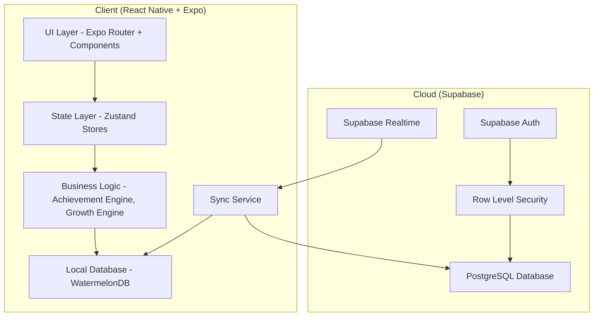
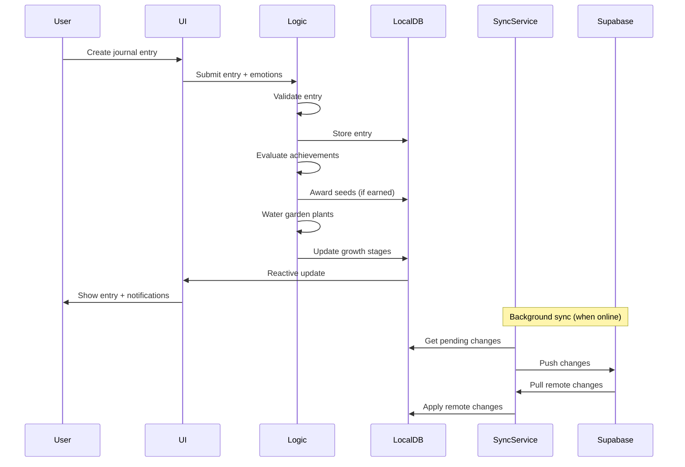
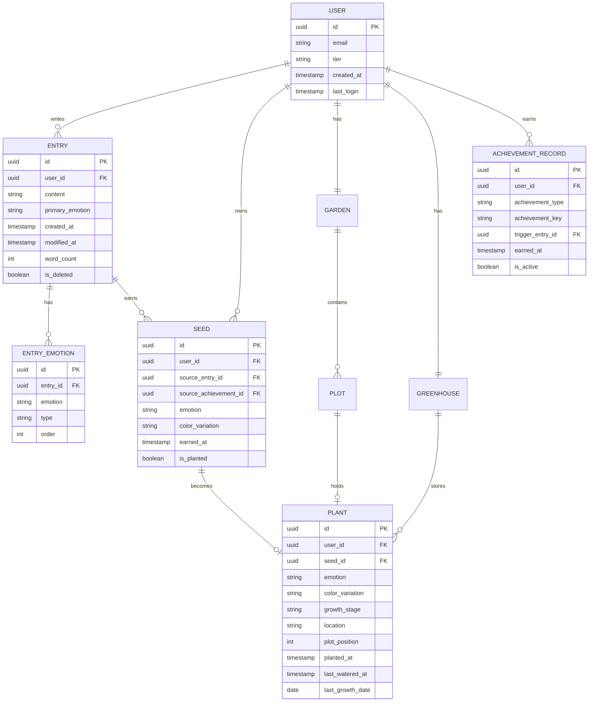

# Design Document: Thought Garden

## Overview

Thought Garden is a cross-platform journaling application that gamifies daily reflection by rewarding users with emotion-based seeds. Users write journal entries, select the emotions associated with their writing, and earn seeds that can be planted in a virtual garden. Plants grow through daily watering (driven by journal entries) and their type and color are determined by the emotions of the entries that earned them.

The system follows a **local-first architecture** where all data operations happen against a local database, with background synchronization to a cloud backend when connectivity is available. This ensures full offline functionality while maintaining cross-device data consistency.

### Key Design Decisions

| Decision | Choice | Rationale |
|----------|--------|-----------|
| Cross-platform framework | React Native + Expo | Single codebase for iOS, Android, and web. Expo provides managed workflow, file-based routing, and web support out of the box. Large ecosystem and JavaScript talent pool. |
| Backend/Auth/Database | Supabase (free tier) | 500MB database, 50K MAU auth, 1GB storage on free tier. PostgreSQL with Row Level Security. Scales to Pro tier ($25/mo) when needed. |
| Local database | WatermelonDB | Purpose-built for React Native offline-first apps. Lazy-loaded, reactive, built-in sync protocol. Supports iOS, Android, and web. |
| State management | Zustand | Lightweight, minimal boilerplate, works well with React Native and offline patterns. |
| Plant visuals | PNG sprite sheets with programmatic palette swapping | Pixel art aesthetic (Stardew Valley / Farmville style) pairs naturally with AI image generation workflow via Microsoft Copilot (DALL-E 3). Palette swapping gives 3,720 visual combinations from 120 base sprites with zero extra art. |
| Navigation | Expo Router | File-based routing, works on mobile and web, deep linking support. |
| Encryption | expo-crypto + Supabase TLS | Local encryption for at-rest data, TLS for in-transit. |

## Architecture

### System Architecture Diagram



### Data Flow



### Layer Responsibilities

| Layer | Responsibility |
|-------|---------------|
| **UI Layer** | Rendering, user input, animations, plant visuals |
| **State Layer** | Reactive state management, UI state, navigation state |
| **Business Logic** | Achievement evaluation, growth calculations, validation, emotion mapping |
| **Local Database** | Persistent storage, queries, reactive subscriptions |
| **Sync Service** | Conflict resolution, push/pull synchronization, connectivity monitoring |

## Components and Interfaces

### Core Modules

```typescript
// Entry Module
interface EntryService {
  createEntry(content: string, primaryEmotion: Emotion, secondaryEmotions: Emotion[]): Promise<Entry>;
  editEntry(id: string, content: string, primaryEmotion: Emotion, secondaryEmotions: Emotion[]): Promise<Entry>;
  deleteEntry(id: string): Promise<void>;
  getEntries(options: { limit?: number; offset?: number; date?: string }): Observable<Entry[]>;
  getEntryCount(): Promise<number>;
  getDailyEntryCount(date: string): Promise<number>;
}

// Achievement Module
interface AchievementEngine {
  evaluateEntry(entry: Entry, context: AchievementContext): Promise<AchievementResult[]>;
  getEarnedAchievements(userId: string): Promise<Achievement[]>;
  resetStreakIfNeeded(userId: string): Promise<void>;
}

interface AchievementContext {
  totalEntryCount: number;
  emotionUsageCounts: Map<Emotion, number>;
  currentStreak: number;
  lastEntryDate: string | null;
  consecutiveSameEmotionCount: number;
  lastConsecutiveEmotion: Emotion | null;
  hasFirstEntry: boolean;
  hasFirstMorningEntry: boolean;
  hasFirstEveningEntry: boolean;
  hasFirstWeekendEntry: boolean;
  hasFirstLongEntry: boolean;
  hasFirstSecondaryEmotion: boolean;
  hasFirstBloom: boolean;
  hasFilledGarden: boolean;
  hasAllEmotionPlants: boolean;
  uniqueEmotionsUsed: Set<Emotion>;
  lifetimeEmotionCounts: Map<Emotion, number>;
}

interface AchievementResult {
  achievement: Achievement;
  seedAwarded: Seed;
}

// Garden Module
interface GardenService {
  getGarden(userId: string): Observable<Garden>;
  plantSeed(seedId: string, plotIndex: number): Promise<void>;
  movePlant(plantId: string, toPlotIndex: number): Promise<void>;
  moveToGreenhouse(plantId: string): Promise<void>;
  moveFromGreenhouse(plantId: string, plotIndex: number): Promise<void>;
  revertToSeed(plantId: string): Promise<void>;
  waterGarden(userId: string): Promise<WateringResult>;
}

interface WateringResult {
  plantsWatered: number;
  plantsAdvanced: PlantGrowthUpdate[];
}

interface PlantGrowthUpdate {
  plantId: string;
  previousStage: GrowthStage;
  newStage: GrowthStage;
}

// Sync Module
interface SyncService {
  startSync(): Promise<SyncResult>;
  getStatus(): SyncStatus;
  onConnectivityChange(connected: boolean): void;
}

type SyncStatus = 'idle' | 'syncing' | 'error' | 'offline';

interface SyncResult {
  pushed: number;
  pulled: number;
  conflicts: number;
}
```

### Authentication Module

```typescript
interface AuthService {
  signInWithEmail(email: string, password: string): Promise<AuthResult>;
  signInWithOAuth(provider: OAuthProvider): Promise<AuthResult>;
  signOut(): Promise<void>;
  getSession(): Promise<Session | null>;
  onAuthStateChange(callback: (session: Session | null) => void): Unsubscribe;
  getFailedAttempts(): Promise<number>;
  isAccountLocked(): Promise<boolean>;
}

type OAuthProvider = 'apple' | 'google';

interface AuthResult {
  success: boolean;
  session?: Session;
  error?: AuthError;
}

interface AuthError {
  code: 'invalid_credentials' | 'network_unavailable' | 'account_not_found' | 'account_locked';
  message: string;
  lockoutRemainingSeconds?: number;
}
```

### Plant Visual System

```typescript
interface PlantVisualService {
  getPlantSprite(emotion: Emotion, stage: GrowthStage, colorVariation: Emotion | null): SpriteData;
  getPlantAnimation(stage: GrowthStage): AnimationConfig;
  applyPaletteSwap(baseSprite: SpriteData, targetPalette: ColorPalette): SpriteData;
}

// 30 emotions x 4 stages x (30 color variations + 1 default) = 3,720 visual combinations
// Achieved through 120 base PNG sprites (32x32px) + runtime palette swapping, NOT 3,720 separate assets

interface SpriteData {
  uri: string;           // Asset path to the sprite sheet PNG
  frameIndex: number;    // Which frame in the sprite sheet (0-3 for growth stages)
  width: 32;            // Sprite width in pixels
  height: 32;           // Sprite height in pixels
}

interface PlantSpriteSheet {
  emotion: Emotion;
  assetPath: string;     // e.g., "assets/sprites/plants/happy-sunflower.png"
  frames: 4;            // 4 frames: seed, sprout, full, bloom (arranged horizontally)
  defaultPalette: ColorPalette;
}

interface ColorPalette {
  primary: string;    // Main plant color (hex)
  secondary: string;  // Accent color (hex)
  highlight: string;  // Detail/glow color (hex)
  shadow: string;     // Shadow/depth color (hex)
}

// Each secondary emotion maps to a color palette for palette swapping
type EmotionColorMap = Record<Emotion, ColorPalette>;

// Garden tilemap rendering
interface GardenTilemap {
  tilesetPath: string;       // "assets/tiles/garden-tileset.png"
  mapDataPath: string;       // "assets/tiles/garden-map.json" (Tiled export)
  tileSize: 32;             // 32x32px tiles
  gridSize: { cols: number; rows: number };
}

// Rendering uses expo-image for sprite display with optional
// react-native-canvas or expo-gl for runtime palette swap shader.
// Fallback: pre-generate palette-swapped PNGs at build time via Node script.
```

## Art Production Pipeline

### Visual Style

Stardew Valley / Farmville inspired 16-bit pixel art. Top-down garden view with isometric-lite perspective. All sprites are 32×32 pixels. The aesthetic is warm, cozy, and readable at mobile screen sizes.

**Environment tileset**: "Sprout Lands - Asset Pack" by Cup Nooble provides the garden environment tiles (soil, grass, fences, paths, decorative elements). Sprout Lands uses a warm, rounded 16×16 pixel art style that is scaled to 32×32 for rendering (nearest-neighbor upscale to preserve pixel crispness). This gives the garden a cohesive cozy/farming aesthetic that works across all age ranges. Plant sprites remain custom AI-generated at native 32×32 to allow full creative control over the 30 emotion-species designs.

### Asset Categories

| Category | Description | Count |
|----------|-------------|-------|
| Garden tilemap | Soil plots, grass, fences, paths, decorative elements | 1 tileset sheet |
| Plant sprites | 30 plants × 4 growth stages = 120 base sprites at 32×32px | 30 sprite sheets |
| UI elements | Seed inventory icons, achievement badges, notification frames | ~3 sheets |
| Background/environment | Sky, seasonal variations (optional) | 1-4 assets |

### Generation Workflow using Microsoft Copilot

The entire art pipeline uses Microsoft Copilot (which includes DALL-E 3) at zero cost. The workflow is designed to produce consistent pixel art across all 30 plant species.

**Step 1: Generate a style reference sheet**

Create one complete plant at all 4 growth stages to establish the pixel art style and serve as a visual anchor for all subsequent generations.

Example prompt:
> "Pixel art sprite sheet showing a sunflower in a pot at 4 growth stages (seed, sprout, full plant, blooming), 32x32 pixels each, Stardew Valley style, transparent background, top-down view, 16-bit retro game aesthetic"

**Step 2: Generate each bloom-stage plant individually**

Use consistent prompts referencing the style sheet to generate the bloom (final) stage for each of the 30 plants.

Example prompt:
> "32x32 pixel art sprite of a [plant name] in a pot, Stardew Valley style, transparent background, top-down view, 16-bit retro game aesthetic, single sprite on clean background"

**Step 3: Manually derive earlier growth stages**

Using Piskel (free, browser-based) or LibreSprite (free Aseprite fork), simplify each bloom sprite to create the sprout and full stages. The seed stage is a universal small pot with soil.

- Bloom → Full: Remove flowers/fruit, keep full leaf structure
- Full → Sprout: Reduce to 1-2 small leaves/stems
- Sprout → Seed: Universal seed-in-pot sprite (shared across all plants, palette-swapped)

**Step 4: Garden tileset (Sprout Lands by Cup Nooble)**

The environment tileset is sourced from "Sprout Lands - Asset Pack" by Cup Nooble rather than AI-generated. This provides a professionally crafted, visually cohesive set of garden tiles (soil, grass, fences, paths, water, decorative flowers, rocks, etc.) in a warm 16×16 pixel art style.

- Download the Sprout Lands asset pack from itch.io
- Use Tiled to assemble the garden map layout from the provided tileset
- Tiles are natively 16×16; render at 2× scale (32×32 on screen) using nearest-neighbor interpolation to match the plant sprite size
- The Sprout Lands palette and rounded style complement the custom plant sprites naturally

### Palette Swap System

The palette swap system multiplies visual variety without requiring additional art assets.

**How it works:**

1. Each base sprite uses a standardized 4-color palette:
   - **Primary**: Main plant body color
   - **Secondary**: Accent/leaf color
   - **Highlight**: Bright detail color
   - **Shadow**: Dark depth color

2. 30 emotion-specific color palettes are defined in `assets/palettes/emotion-palettes.json`

3. At runtime, the rendering system replaces the base palette colors with the target emotion's palette

4. This gives: 120 base sprites × 31 palette options (30 emotions + default) = **3,720 visual combinations** with zero extra art

**Example palette definition:**

```json
{
  "happy": {
    "primary": "#FFD700",
    "secondary": "#FFA500",
    "highlight": "#FFFACD",
    "shadow": "#B8860B"
  },
  "sad": {
    "primary": "#4682B4",
    "secondary": "#5F9EA0",
    "highlight": "#B0C4DE",
    "shadow": "#2F4F4F"
  }
}
```

### Free Tools

| Tool | Purpose | Cost |
|------|---------|------|
| Microsoft Copilot (DALL-E 3) | Sprite generation | Free (included with Microsoft account) |
| Piskel | Pixel art cleanup, animation, sprite sheet assembly | Free (browser-based) |
| LibreSprite | Advanced sprite editing (free Aseprite fork) | Free (open source) |
| Tiled | Tilemap editor for garden layout | Free (open source) |
| Sprout Lands - Asset Pack (Cup Nooble) | Primary environmental tileset (soil, grass, fences, paths, decorations) | Pro license (minimal cost, covers commercial use) |

### Asset File Structure

```
assets/
├── sprites/
│   ├── plants/
│   │   ├── happy-sunflower.png      (sprite sheet: 4 frames for 4 stages)
│   │   ├── sad-weeping-willow.png
│   │   ├── angry-cactus.png
│   │   └── ... (30 total)
│   ├── seeds/
│   │   └── seed-icons.png           (30 seed inventory icons)
│   └── ui/
│       ├── achievement-badges.png
│       └── notification-frame.png
├── tiles/
│   ├── garden-tileset.png           (Sprout Lands by Cup Nooble - soil, grass, fences, paths, decorations)
│   └── garden-map.json             (Tiled export)
└── palettes/
    └── emotion-palettes.json        (30 color palette definitions)
```

### Rendering Approach

- **Primary**: Use `react-native-canvas` or `expo-gl` for a palette swap shader that replaces base colors at runtime
- **Fallback**: Pre-generate palette-swapped PNGs at build time using a Node script (simpler, no runtime cost, larger bundle)
- **Sprite display**: `expo-image` for efficient PNG rendering with caching
- **Garden grid**: Rendered as a tilemap with plants overlaid at plot positions
- **Animations**: Frame-based sprite animation for growth transitions (swap between sprite sheet frames)

## Data Models

### Entity Relationship Diagram



### WatermelonDB Schema (Local)

```typescript
import { appSchema, tableSchema } from '@nozbe/watermelondb';

export const schema = appSchema({
  version: 1,
  tables: [
    tableSchema({
      name: 'entries',
      columns: [
        { name: 'user_id', type: 'string', isIndexed: true },
        { name: 'content', type: 'string' },
        { name: 'primary_emotion', type: 'string' },
        { name: 'word_count', type: 'number' },
        { name: 'created_at', type: 'number' },
        { name: 'modified_at', type: 'number', isOptional: true },
        { name: 'is_deleted', type: 'boolean' },
      ],
    }),
    tableSchema({
      name: 'entry_emotions',
      columns: [
        { name: 'entry_id', type: 'string', isIndexed: true },
        { name: 'emotion', type: 'string' },
        { name: 'type', type: 'string' },
        { name: 'order', type: 'number' },
      ],
    }),
    tableSchema({
      name: 'seeds',
      columns: [
        { name: 'user_id', type: 'string', isIndexed: true },
        { name: 'source_entry_id', type: 'string', isOptional: true },
        { name: 'source_achievement_id', type: 'string' },
        { name: 'emotion', type: 'string' },
        { name: 'color_variation', type: 'string', isOptional: true },
        { name: 'earned_at', type: 'number' },
        { name: 'is_planted', type: 'boolean' },
      ],
    }),
    tableSchema({
      name: 'plants',
      columns: [
        { name: 'user_id', type: 'string', isIndexed: true },
        { name: 'seed_id', type: 'string' },
        { name: 'emotion', type: 'string' },
        { name: 'color_variation', type: 'string', isOptional: true },
        { name: 'growth_stage', type: 'string' },
        { name: 'location', type: 'string' },
        { name: 'plot_position', type: 'number', isOptional: true },
        { name: 'planted_at', type: 'number' },
        { name: 'last_watered_at', type: 'number', isOptional: true },
        { name: 'last_growth_date', type: 'string', isOptional: true },
      ],
    }),
    tableSchema({
      name: 'achievement_records',
      columns: [
        { name: 'user_id', type: 'string', isIndexed: true },
        { name: 'achievement_type', type: 'string' },
        { name: 'achievement_key', type: 'string', isIndexed: true },
        { name: 'trigger_entry_id', type: 'string', isOptional: true },
        { name: 'earned_at', type: 'number' },
        { name: 'is_active', type: 'boolean' },
      ],
    }),
    tableSchema({
      name: 'user_stats',
      columns: [
        { name: 'user_id', type: 'string', isIndexed: true },
        { name: 'total_entries', type: 'number' },
        { name: 'current_streak', type: 'number' },
        { name: 'last_entry_date', type: 'string', isOptional: true },
        { name: 'consecutive_same_emotion', type: 'number' },
        { name: 'last_emotion', type: 'string', isOptional: true },
        { name: 'tier', type: 'string' },
      ],
    }),
  ],
});
```

### Supabase Schema (Cloud)

```sql
-- Users table (managed by Supabase Auth, extended with profile)
CREATE TABLE user_profiles (
  id UUID PRIMARY KEY REFERENCES auth.users(id),
  tier TEXT NOT NULL DEFAULT 'free' CHECK (tier IN ('free', 'paid')),
  created_at TIMESTAMPTZ NOT NULL DEFAULT NOW(),
  updated_at TIMESTAMPTZ NOT NULL DEFAULT NOW()
);

-- Entries
CREATE TABLE entries (
  id UUID PRIMARY KEY DEFAULT gen_random_uuid(),
  user_id UUID NOT NULL REFERENCES auth.users(id),
  content TEXT NOT NULL CHECK (char_length(content) <= 10000),
  primary_emotion TEXT NOT NULL,
  word_count INTEGER NOT NULL DEFAULT 0,
  created_at TIMESTAMPTZ NOT NULL DEFAULT NOW(),
  modified_at TIMESTAMPTZ,
  is_deleted BOOLEAN NOT NULL DEFAULT FALSE,
  _status TEXT,
  _changed TEXT,
  last_modified_at TIMESTAMPTZ NOT NULL DEFAULT NOW()
);

-- Entry emotions
CREATE TABLE entry_emotions (
  id UUID PRIMARY KEY DEFAULT gen_random_uuid(),
  entry_id UUID NOT NULL REFERENCES entries(id) ON DELETE CASCADE,
  emotion TEXT NOT NULL,
  type TEXT NOT NULL CHECK (type IN ('primary', 'secondary')),
  "order" INTEGER NOT NULL DEFAULT 0,
  last_modified_at TIMESTAMPTZ NOT NULL DEFAULT NOW()
);

-- Seeds
CREATE TABLE seeds (
  id UUID PRIMARY KEY DEFAULT gen_random_uuid(),
  user_id UUID NOT NULL REFERENCES auth.users(id),
  source_entry_id UUID REFERENCES entries(id),
  source_achievement_id UUID NOT NULL,
  emotion TEXT NOT NULL,
  color_variation TEXT,
  earned_at TIMESTAMPTZ NOT NULL DEFAULT NOW(),
  is_planted BOOLEAN NOT NULL DEFAULT FALSE,
  last_modified_at TIMESTAMPTZ NOT NULL DEFAULT NOW()
);

-- Plants
CREATE TABLE plants (
  id UUID PRIMARY KEY DEFAULT gen_random_uuid(),
  user_id UUID NOT NULL REFERENCES auth.users(id),
  seed_id UUID NOT NULL REFERENCES seeds(id),
  emotion TEXT NOT NULL,
  color_variation TEXT,
  growth_stage TEXT NOT NULL DEFAULT 'seed'
    CHECK (growth_stage IN ('seed', 'sprout', 'full', 'bloom')),
  location TEXT NOT NULL DEFAULT 'garden'
    CHECK (location IN ('garden', 'greenhouse')),
  plot_position INTEGER,
  planted_at TIMESTAMPTZ NOT NULL DEFAULT NOW(),
  last_watered_at TIMESTAMPTZ,
  last_growth_date DATE,
  last_modified_at TIMESTAMPTZ NOT NULL DEFAULT NOW()
);

-- Achievement records
CREATE TABLE achievement_records (
  id UUID PRIMARY KEY DEFAULT gen_random_uuid(),
  user_id UUID NOT NULL REFERENCES auth.users(id),
  achievement_type TEXT NOT NULL,
  achievement_key TEXT NOT NULL,
  trigger_entry_id UUID REFERENCES entries(id),
  earned_at TIMESTAMPTZ NOT NULL DEFAULT NOW(),
  is_active BOOLEAN NOT NULL DEFAULT TRUE,
  last_modified_at TIMESTAMPTZ NOT NULL DEFAULT NOW(),
  UNIQUE(user_id, achievement_key)
);

-- Row Level Security
ALTER TABLE entries ENABLE ROW LEVEL SECURITY;
ALTER TABLE entry_emotions ENABLE ROW LEVEL SECURITY;
ALTER TABLE seeds ENABLE ROW LEVEL SECURITY;
ALTER TABLE plants ENABLE ROW LEVEL SECURITY;
ALTER TABLE achievement_records ENABLE ROW LEVEL SECURITY;
ALTER TABLE user_profiles ENABLE ROW LEVEL SECURITY;

-- RLS Policies (user can only access their own data)
CREATE POLICY "Users can only access own entries"
  ON entries FOR ALL USING (auth.uid() = user_id);

CREATE POLICY "Users can only access own entry_emotions"
  ON entry_emotions FOR ALL USING (
    entry_id IN (SELECT id FROM entries WHERE user_id = auth.uid())
  );

CREATE POLICY "Users can only access own seeds"
  ON seeds FOR ALL USING (auth.uid() = user_id);

CREATE POLICY "Users can only access own plants"
  ON plants FOR ALL USING (auth.uid() = user_id);

CREATE POLICY "Users can only access own achievements"
  ON achievement_records FOR ALL USING (auth.uid() = user_id);

CREATE POLICY "Users can only access own profile"
  ON user_profiles FOR ALL USING (auth.uid() = id);
```

### Core Type Definitions

```typescript
export const EMOTIONS = [
  'happy', 'sad', 'angry', 'anxious', 'calm',
  'grateful', 'love', 'hope', 'excited', 'lonely',
  'proud', 'confused', 'peaceful', 'nostalgic', 'jealous',
  'inspired', 'guilty', 'curious', 'frustrated', 'content',
  'overwhelmed', 'brave', 'embarrassed', 'surprised', 'bored',
  'determined', 'compassionate', 'melancholy', 'joyful', 'vulnerable',
] as const;

export type Emotion = typeof EMOTIONS[number];

export type GrowthStage = 'seed' | 'sprout' | 'full' | 'bloom';

export const GROWTH_STAGE_ORDER: Record<GrowthStage, number> = {
  seed: 0,
  sprout: 1,
  full: 2,
  bloom: 3,
};

export const NEXT_STAGE: Record<GrowthStage, GrowthStage | null> = {
  seed: 'sprout',
  sprout: 'full',
  full: 'bloom',
  bloom: null, // Terminal stage
};

export type Tier = 'free' | 'paid';

export const TIER_LIMITS: Record<Tier, { gardenPlots: number; greenhouseCapacity: number }> = {
  free: { gardenPlots: 9, greenhouseCapacity: 3 },
  paid: { gardenPlots: 25, greenhouseCapacity: 10 },
};
```

## Correctness Properties

*A property is a characteristic or behavior that should hold true across all valid executions of a system — essentially, a formal statement about what the system should do. Properties serve as the bridge between human-readable specifications and machine-verifiable correctness guarantees.*

### Property 1: Entry content validation

*For any* string, the entry submission system SHALL accept it if and only if it contains at least one non-whitespace character AND has length <= 10,000 characters. Strings that are empty, whitespace-only, or exceed 10,000 characters SHALL be rejected with the entry state unchanged.

**Validates: Requirements 2.1, 2.7**

### Property 2: Emotion selection validation

*For any* entry submission, the system SHALL accept it if and only if exactly one Primary_Emotion is selected from the 30-emotion set, and all Secondary_Emotions (if any) are from the 30-emotion set excluding the selected Primary_Emotion.

**Validates: Requirements 2.2, 2.3, 3.1**

### Property 3: Free tier daily entry limit

*For any* free-tier user and any calendar day (in device local timezone), the system SHALL accept at most one entry. The second and subsequent entry attempts on the same calendar day SHALL be rejected. For any paid-tier user, entry creation SHALL never be rejected due to daily limits.

**Validates: Requirements 2.4, 2.5, 2.6**

### Property 4: Entry persistence round-trip

*For any* valid entry (content, primary emotion, secondary emotions), after successful submission, reading the entry back from storage SHALL return identical content, identical emotion selections, a valid timestamp, and the correct user identifier.

**Validates: Requirements 2.8**

### Property 5: Entry edit preserves creation timestamp

*For any* existing entry that is edited, the original `created_at` timestamp SHALL remain unchanged, and a `modified_at` timestamp SHALL be set to the time of the edit.

**Validates: Requirements 3.2**

### Property 6: Seed immutability

*For any* seed that has been awarded, the seed's emotion type and color variation SHALL never change regardless of subsequent operations on the source entry (editing primary emotion, editing secondary emotions, or deleting the entry). The seed SHALL persist in inventory or as a planted plant regardless of source entry modifications.

**Validates: Requirements 3.4, 3.5, 4.23, 7.2**

### Property 7: Achievement engine awards correct seeds

*For any* action that triggers N achievements simultaneously (where N >= 1), the system SHALL award exactly N seeds, each with the emotion type determined by the specific achievement's rules. No achievement trigger SHALL fail to produce a seed, and no extra seeds SHALL be produced.

**Validates: Requirements 4.1, 4.4**

### Property 8: Emotion frequency tiebreaker

*For any* set of emotions with equal usage frequency, the system SHALL select the emotion that was used most recently (by entry timestamp) when determining "most frequently used" or "most common" emotion for achievement rewards.

**Validates: Requirements 4.5**

### Property 9: First-time emotion achievement

*For any* emotion from the 30-emotion set, the first time a user selects it as Primary_Emotion, the system SHALL award exactly one seed of that emotion type. Subsequent uses of the same emotion as Primary_Emotion SHALL NOT trigger this achievement again.

**Validates: Requirements 4.8**

### Property 10: Streak calculation correctness

*For any* sequence of entry dates, the journaling streak SHALL equal the number of consecutive calendar days (in device local timezone) with at least one entry, counting backwards from the most recent entry date. Streak achievements SHALL trigger at exactly 3, 7, 14, and 30 consecutive days.

**Validates: Requirements 4.18**

### Property 11: Streak reset after inactivity

*For any* user with a previously earned streak achievement, if 30 or more consecutive calendar days pass without any journal entry, that streak achievement SHALL be reset to allow re-earning. Gaps of fewer than 30 days SHALL NOT trigger a reset.

**Validates: Requirements 4.19**

### Property 12: Returning achievement

*For any* gap of 7 or more consecutive calendar days without a journal entry, the next entry submitted SHALL trigger the Returning Achievement and award one seed. Gaps of fewer than 7 days SHALL NOT trigger this achievement.

**Validates: Requirements 4.20**

### Property 13: Consistent theme achievement

*For any* sequence of 5 consecutive entries (by submission timestamp) with the same Primary_Emotion, the system SHALL trigger the Consistent Theme Achievement and award one seed of that emotion type. Sequences of fewer than 5 SHALL NOT trigger it.

**Validates: Requirements 4.21**

### Property 14: Emotion milestone achievement

*For any* emotion, when the lifetime count of entries with that emotion as Primary_Emotion reaches exactly 10, 25, or 50, the system SHALL award one seed of that emotion type. Each milestone SHALL trigger at most once per emotion.

**Validates: Requirements 4.22**

### Property 15: Garden grid size by tier

*For any* free-tier user, the garden SHALL contain exactly 9 plots. *For any* paid-tier user, the garden SHALL contain exactly 25 plots.

**Validates: Requirements 5.2, 5.3**

### Property 16: Planting transfers seed to garden

*For any* seed in inventory and any empty plot, planting SHALL remove the seed from inventory, create a plant at the specified plot with the seed's emotion and color variation, and set the plant's growth stage to "seed". If no empty plot exists, the operation SHALL fail and the seed SHALL remain in inventory.

**Validates: Requirements 5.4, 5.7**

### Property 17: Plant movement preserves state

*For any* plant in a garden plot and any empty target plot, moving the plant SHALL place it at the target plot with all properties unchanged (growth stage, emotion, color) and leave the source plot empty. If the target plot is occupied, the move SHALL fail and the plant SHALL remain at its original position.

**Validates: Requirements 5.5, 5.8**

### Property 18: Watering advances all garden plants

*For any* garden with N plants, when a journal entry is submitted, all N plants currently in the garden SHALL be watered. Each plant SHALL advance by at most one growth stage per calendar day, triggered only by the first watering event of that day.

**Validates: Requirements 6.1, 6.2**

### Property 19: Growth stage monotonicity

*For any* plant, the growth stage SHALL never decrease. The stage progression is strictly: seed -> sprout -> full -> bloom. Once a plant reaches bloom, it SHALL remain at bloom regardless of any subsequent operations.

**Validates: Requirements 6.3, 6.4**

### Property 20: Late-planted seeds wait for next watering

*For any* seed planted in the garden after the day's first journal entry has already been submitted, the plant SHALL remain at the "seed" growth stage until the next calendar day's first watering event.

**Validates: Requirements 6.5**

### Property 21: Emotion-to-species bijection

*For any* two distinct emotions from the 30-emotion set, their mapped plant species SHALL be distinct. The mapping SHALL be deterministic — the same emotion always produces the same species visual.

**Validates: Requirements 7.1, 7.5**

### Property 22: Color variation determination

*For any* seed, the color variation SHALL be determined by the first Secondary_Emotion (by user selection order) of the entry that earned the seed. If the entry has no Secondary_Emotions, the default color palette SHALL be used. This determination is fixed at seed creation time.

**Validates: Requirements 7.3, 7.4**

### Property 23: Visual consistency across growth stages

*For any* plant, the species visual and color variation SHALL be identical across all four growth stages (seed, sprout, full, bloom). Only the structural form changes between stages, not the identity.

**Validates: Requirements 7.6**

### Property 24: Greenhouse stasis

*For any* plant moved to the greenhouse, the plant's growth stage SHALL not change regardless of how many watering events occur while it is in the greenhouse. When moved back to the garden, the plant SHALL resume at exactly the growth stage it had when stored.

**Validates: Requirements 8.1, 8.2**

### Property 25: Greenhouse capacity by tier

*For any* free-tier user, the greenhouse SHALL hold at most 3 plants. *For any* paid-tier user, the greenhouse SHALL hold at most 10 plants. Attempts to store beyond capacity SHALL be rejected.

**Validates: Requirements 8.3, 8.4**

### Property 26: Revert-to-seed preserves emotion

*For any* plant that is reverted to a seed, the resulting seed SHALL have the same emotion type as the plant that was reverted. The plant SHALL be removed and the seed SHALL appear in the user's inventory.

**Validates: Requirements 8.6**

### Property 27: Sync conflict resolution by timestamp

*For any* sync conflict between local and cloud data for the same record, the system SHALL preserve the version with the most recent device-generated timestamp. The losing version SHALL be discarded.

**Validates: Requirements 9.4**

### Property 28: User data isolation

*For any* two distinct authenticated users A and B, user A SHALL NOT be able to read, modify, or delete any data belonging to user B. All queries SHALL be scoped to the authenticated user's ID.

**Validates: Requirements 10.3**

### Property 29: Account lockout threshold

*For any* sequence of consecutive failed authentication attempts, the account SHALL be locked if and only if the count reaches 5. The lockout SHALL last exactly 15 minutes before allowing further attempts.

**Validates: Requirements 1.5**

## Error Handling

### Error Categories and Strategies

| Category | Examples | Strategy |
|----------|----------|----------|
| **Validation Errors** | Empty content, invalid emotion selection, daily limit reached | Prevent action, show inline error message, preserve user input |
| **Auth Errors** | Invalid credentials, expired session, account locked | Show specific error message, offer retry or re-authentication |
| **Storage Errors** | Local DB write failure, disk full | Retry once, show error toast, preserve data in memory for retry |
| **Sync Errors** | Network timeout, server error, conflict | Retry up to 3 times with exponential backoff, fall back to local-only |
| **Capacity Errors** | Garden full, greenhouse full | Show capacity message, offer alternatives (revert, upgrade) |

### Error Handling Patterns

```typescript
// Centralized error types
type AppError =
  | { type: 'validation'; field: string; message: string }
  | { type: 'auth'; code: AuthErrorCode; message: string; lockoutSeconds?: number }
  | { type: 'storage'; operation: string; retryable: boolean }
  | { type: 'sync'; attempt: number; maxAttempts: number; nextRetry?: Date }
  | { type: 'capacity'; resource: 'garden' | 'greenhouse'; current: number; max: number };

// Result type for operations that can fail
type Result<T> = { success: true; data: T } | { success: false; error: AppError };

// Retry strategy for sync
interface RetryConfig {
  maxAttempts: 3;
  baseDelay: 1000;      // 1 second
  maxDelay: 30000;      // 30 seconds
  backoffMultiplier: 2; // Exponential backoff
}
```

### Offline Error Handling

- All write operations succeed against local DB (no network errors possible for writes)
- Sync errors are queued and retried when connectivity returns
- Auth session is validated locally using cached session data
- If local session is expired and no network is available, user sees "network required" message

### Data Integrity Safeguards

- **Atomic operations**: Entry creation + achievement evaluation + watering happen in a single WatermelonDB batch write
- **Optimistic updates**: UI updates immediately, rolls back on local DB write failure
- **Conflict resolution**: Last-write-wins based on device-generated timestamps during sync
- **Soft deletes**: Entries are marked `is_deleted` rather than physically removed, enabling sync

## Testing Strategy

### Testing Approach

The testing strategy uses a dual approach:

1. **Property-based tests** (using [fast-check](https://github.com/dubzzz/fast-check)): Verify universal correctness properties across randomized inputs. Each property test runs a minimum of 100 iterations.
2. **Unit tests** (using Jest): Verify specific examples, edge cases, integration points, and one-time achievement triggers.
3. **Integration tests**: Verify sync behavior, auth flows, and cross-module interactions.

### Property-Based Testing Configuration

- **Library**: fast-check (TypeScript property-based testing)
- **Minimum iterations**: 100 per property
- **Tag format**: `Feature: thought-garden, Property {N}: {title}`
- **Location**: `__tests__/properties/` directory

Each correctness property from the design maps to exactly one property-based test:

| Property | Test File | What It Generates |
|----------|-----------|-------------------|
| 1: Entry content validation | `entry-validation.property.test.ts` | Random strings (empty, whitespace, valid, oversized) |
| 2: Emotion selection validation | `emotion-validation.property.test.ts` | Random emotion sets (0, 1, 2+ primary; valid/invalid secondary) |
| 3: Free tier daily limit | `tier-limits.property.test.ts` | Random dates, tier combinations, entry sequences |
| 4: Entry persistence round-trip | `entry-persistence.property.test.ts` | Random valid entries (content, emotions) |
| 5: Entry edit timestamps | `entry-edit.property.test.ts` | Random entries with random edits |
| 6: Seed immutability | `seed-immutability.property.test.ts` | Random seeds with source entry modifications |
| 7: Achievement awards | `achievement-engine.property.test.ts` | Random actions triggering 1-N achievements |
| 8: Tiebreaker | `tiebreaker.property.test.ts` | Random emotion histories with ties |
| 9: First-time emotion | `first-emotion.property.test.ts` | Random emotion sequences |
| 10: Streak calculation | `streak.property.test.ts` | Random date sequences |
| 11: Streak reset | `streak-reset.property.test.ts` | Random gaps of varying lengths |
| 12: Returning achievement | `returning.property.test.ts` | Random gap durations |
| 13: Consistent theme | `consistent-theme.property.test.ts` | Random emotion sequences |
| 14: Emotion milestone | `emotion-milestone.property.test.ts` | Random entry counts per emotion |
| 15: Garden grid size | `garden-grid.property.test.ts` | Random tier values |
| 16: Planting | `planting.property.test.ts` | Random seeds, random plot states |
| 17: Plant movement | `plant-movement.property.test.ts` | Random plants, random target plots |
| 18: Watering | `watering.property.test.ts` | Random garden states, random dates |
| 19: Growth monotonicity | `growth-monotonicity.property.test.ts` | Random operation sequences on plants |
| 20: Late planting | `late-planting.property.test.ts` | Random planting times relative to watering |
| 21: Emotion-species bijection | `emotion-species.property.test.ts` | All emotion pairs |
| 22: Color variation | `color-variation.property.test.ts` | Random entries with varying secondary emotions |
| 23: Visual consistency | `visual-consistency.property.test.ts` | Random plants across all stages |
| 24: Greenhouse stasis | `greenhouse-stasis.property.test.ts` | Random plants with watering sequences |
| 25: Greenhouse capacity | `greenhouse-capacity.property.test.ts` | Random tier + plant counts |
| 26: Revert to seed | `revert-seed.property.test.ts` | Random plants reverted |
| 27: Sync conflict | `sync-conflict.property.test.ts` | Random conflicting records with timestamps |
| 28: User data isolation | `data-isolation.property.test.ts` | Random user pairs with data |
| 29: Account lockout | `account-lockout.property.test.ts` | Random failure sequences |

### Unit Test Coverage

Unit tests focus on:
- **One-time achievements**: First entry, milestones (10/50/100), first morning/evening/weekend, first bloom, first full garden, all 30 emotions grown
- **Edge cases**: Exactly at boundaries (10,000 chars, 5 auth failures, day boundaries in timezones)
- **UI interactions**: Confirmation dialogs, notification display, drag-and-drop cancellation
- **Error messages**: Correct error codes and messages for each failure type

### Integration Test Coverage

- Auth flow: Sign in -> session persistence -> sign out -> data cleanup
- Sync flow: Create offline -> go online -> verify sync -> conflict resolution
- Full journaling flow: Create entry -> earn achievement -> get seed -> plant -> water -> grow

### Test Infrastructure

```
__tests__/
├── properties/          # Property-based tests (fast-check)
│   ├── entry-validation.property.test.ts
│   ├── emotion-validation.property.test.ts
│   ├── tier-limits.property.test.ts
│   ├── ...
│   └── generators/      # Shared test data generators
│       ├── emotion.gen.ts
│       ├── entry.gen.ts
│       ├── garden.gen.ts
│       └── plant.gen.ts
├── unit/                # Unit tests (Jest)
│   ├── achievements/
│   ├── garden/
│   ├── entries/
│   └── auth/
└── integration/         # Integration tests
    ├── sync.test.ts
    ├── auth-flow.test.ts
    └── journaling-flow.test.ts
```
